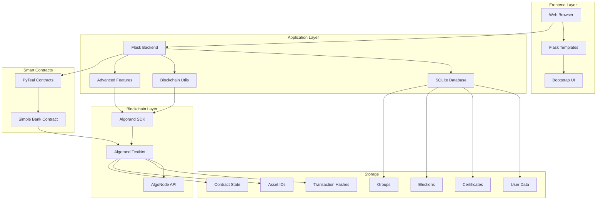
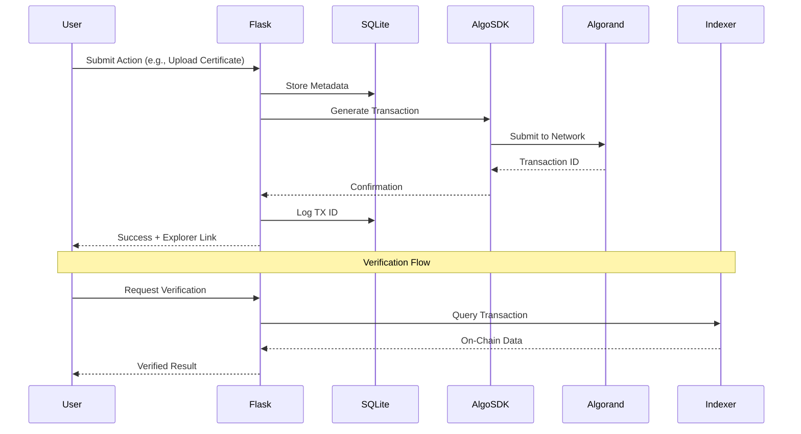

# 🛡️ CampusTrust - Blockchain-Powered Campus Management System

[](https://www.algorand.com/)
[](https://www.python.org/)
[](https://flask.palletsprojects.com/)
[](https://pyteal.readthedocs.io/)
[](LICENSE)

> **A decentralized campus management platform leveraging Algorand blockchain for transparent certificate verification, democratic elections, group collaboration, and advanced token operations.**

---

## 📌 Project Overview

### **The Problem**
Traditional campus management systems face critical challenges:
- **Certificate Fraud**: Fake certificates are easily created and hard to verify
- **Election Manipulation**: Centralized voting systems lack transparency and can be tampered with
- **Data Integrity**: Student records can be altered without audit trails
- **Trust Deficit**: No immutable proof of achievements or participation
- **Collaboration Opacity**: Group activities lack transparent tracking

### **Why Blockchain?**
CampusTrust uses **Algorand blockchain** instead of traditional databases because:

| Traditional Database | Blockchain (Algorand) |
|---------------------|----------------------|
| ❌ Centralized control | ✅ Decentralized verification |
| ❌ Mutable records | ✅ Immutable proof |
| ❌ Single point of failure | ✅ Distributed consensus |
| ❌ Trust required in admin | ✅ Cryptographic verification |
| ❌ No public audit trail | ✅ Transparent transaction history |
| ❌ Slow international verification | ✅ Instant global verification |

### **Real-World Use Cases**
1. **Universities**: Issue tamper-proof digital certificates
2. **Student Organizations**: Conduct transparent elections
3. **Recruiters**: Instantly verify candidate credentials
4. **International Students**: Prove qualifications across borders
5. **Campus Groups**: Track collaborative projects with blockchain-backed milestones
6. **Token Economies**: Create loyalty tokens or campus currencies

---

## 🧠 System Architecture

### **High-Level Architecture**



### **On-Chain vs Off-Chain Logic**

| Component | Storage Location | Reason |
|-----------|-----------------|--------|
| **User Credentials** | Off-Chain (SQLite) | Privacy, GDPR compliance, fast authentication |
| **Certificate Hashes** | On-Chain (Algorand) | Immutable proof, public verification |
| **Election Votes** | On-Chain (Algorand) | Transparency, tamper-proof results |
| **Group Milestones** | On-Chain (Algorand) | Permanent achievement records |
| **Token Metadata** | On-Chain (ASA) | Decentralized asset management |
| **Smart Contract State** | On-Chain (App State) | Trustless execution |
| **Transaction Logs** | Hybrid (DB + File + Chain) | Audit trail redundancy |

### **Transaction Lifecycle**



---

## 🚀 Core Features

### 1. **Certificate Verification System**

#### **What It Does**
- Students upload academic certificates (PDF/Image)
- System generates SHA-256 hash of the file
- Hash is stored on Algorand blockchain as transaction note
- QR code generated linking to AlgoExplorer transaction
- Anyone can verify certificate authenticity by uploading the file

#### **Why It's Needed**
- Prevents certificate forgery (changing 1 bit changes entire hash)
- Enables instant verification by employers/universities
- Creates permanent, tamper-proof record
- No central authority needed for verification

#### **Blockchain Logic**
```python
# Simplified flow
file_hash = hashlib.sha256(file_content).hexdigest()
note = f"CERT|user:{user_id}|hash:{file_hash}|timestamp:{timestamp}"
tx = PaymentTxn(sender=wallet, receiver=wallet, amt=0, note=note.encode())
tx_id = algod_client.send_transaction(signed_tx)
```

#### **Gas Implications**
- **Cost**: ~0.001 ALGO per certificate (~$0.0003 USD)
- **Optimization**: Uses 0 ALGO payment-to-self (only network fee)
- **Note Field**: 1024 bytes max (sufficient for hash + metadata)

#### **Security Considerations**
- Hash collision resistance (SHA-256 = 2^256 possibilities)
- Ownership binding prevents certificate reuse
- Timestamp prevents backdating
- Public verification without exposing file content

---

### 2. **Decentralized Elections**

#### **What It Does**
- Admin creates elections with candidates
- Students vote once per election
- Votes recorded on blockchain with encrypted candidate ID
- Results calculated transparently from blockchain data

#### **Why It's Needed**
- Eliminates vote manipulation
- Provides public audit trail
- Prevents double-voting (enforced by smart contract logic)
- Instant, verifiable results

#### **Transaction Flow**
```
Student → Select Candidate → Flask validates eligibility → 
Generate vote hash → Submit to Algorand → 
Store TX ID in DB → Update vote count → Display confirmation
```

#### **Example Input/Output**
```python
# Input
{
  "election_id": 5,
  "candidate_id": 12,
  "voter_id": 101
}

# Blockchain Note
"VOTE|election:5|voter:101|candidate:ENCRYPTED|timestamp:2026-02-12T20:00:00"

# Output
{
  "success": true,
  "tx_id": "XYZABC123...",
  "explorer_url": "https://testnet.algoexplorer.io/tx/XYZABC123"
}
```

---

### 3. **Group Collaboration & Milestones**

#### **What It Does**
- Students create/join project groups
- Group leads assign tasks and milestones
- Completions recorded on blockchain
- Transparent contribution tracking

#### **Smart Contract Logic**
- Uses standardized note format for milestone records
- Immutable timestamp of achievements
- Queryable via Algorand Indexer

---

### 4. **Advanced Algorand Features**

#### **4.1 ALGO Payments**
- Send ALGO to any address with custom notes
- Real-time transaction confirmation
- Explorer integration for tracking

#### **4.2 ASA (Algorand Standard Asset) Creation**
- Create custom fungible tokens (loyalty points, campus currency)
- Configurable supply, decimals, and metadata
- Use cases: Reward systems, stablecoins, governance tokens

#### **4.3 NFT Minting**
- Mint unique NFTs (badges, achievements, certificates)
- IPFS integration for metadata
- Permanent ownership records

#### **4.4 Smart Contracts (PyTeal)**
- **Simple Bank Demo**: Deposit/withdraw ALGO
- Stateful contract with global state management
- Inner transactions for automated payments

#### **4.5 Indexer Integration**
- Query transaction history
- Track contract interactions
- Audit deposit/withdrawal flows

---

## 🏗️ Tech Stack

### **Blockchain Layer**

| Technology | Purpose | Why Chosen | Alternatives |
|-----------|---------|------------|--------------|
| **Algorand** | Layer-1 blockchain | ✅ 4.5s finality<br>✅ Low fees (~$0.001/tx)<br>✅ Carbon negative<br>✅ Pure PoS consensus | Ethereum (slower, expensive), Polygon (less decentralized) |
| **PyTeal** | Smart contract language | ✅ Python-based (team expertise)<br>✅ Compiles to TEAL<br>✅ Type safety | Reach (less mature), TEAL (low-level) |
| **AlgoSDK (Python)** | Blockchain interaction | ✅ Official SDK<br>✅ Comprehensive API<br>✅ Active maintenance | JavaScript SDK (different language) |
| **AlgoNode** | RPC Provider | ✅ Free tier<br>✅ High reliability<br>✅ TestNet + MainNet | Purestake (rate limits), Local node (maintenance overhead) |

### **Backend**

| Technology | Purpose | Why Chosen | Alternatives |
|-----------|---------|------------|--------------|
| **Flask** | Web framework | ✅ Lightweight<br>✅ Easy integration<br>✅ Rapid prototyping | Django (overkill), FastAPI (async not needed) |
| **SQLite** | Relational database | ✅ Zero configuration<br>✅ File-based<br>✅ Perfect for MVP | PostgreSQL (deployment complexity), MongoDB (not relational) |
| **Werkzeug** | Password hashing | ✅ Built into Flask<br>✅ Secure defaults | bcrypt (extra dependency) |

### **Frontend**

| Technology | Purpose | Why Chosen | Alternatives |
|-----------|---------|------------|--------------|
| **Bootstrap 5** | UI framework | ✅ Responsive design<br>✅ Pre-built components<br>✅ Accessibility | TailwindCSS (more config), Material UI (React-focused) |
| **Jinja2** | Templating | ✅ Flask native<br>✅ Server-side rendering | React (overkill for this project) |
| **Font Awesome** | Icons | ✅ Comprehensive library<br>✅ CDN delivery | Material Icons (less variety) |

### **Testing & Deployment**

| Technology | Purpose | Why Chosen |
|-----------|---------|------------|
| **unittest** | Testing framework | ✅ Python standard library<br>✅ No dependencies |
| **Mock** | Blockchain mocking | ✅ Isolate tests from network<br>✅ Fast execution |

---

## 📂 Project Structure

```
campus-trust/
│
├── algorand/                      # Blockchain integration layer
│   ├── connect.py                 # Algorand client & wallet setup
│   ├── store_hash.py              # Core transaction submission logic
│   ├── advanced_features.py       # ASA, NFT, Smart Contract functions
│   └── contracts/
│       └── simple_bank.py         # PyTeal smart contract (deposit/withdraw)
│
├── utils/                         # Helper utilities
│   ├── hash_utils.py              # SHA-256 file hashing
│   └── blockchain_utils.py        # Standardized note formatting
│
├── templates/                     # Jinja2 HTML templates
│   ├── base.html                  # Base layout (navbar, footer)
│   ├── dashboard.html             # Main user dashboard
│   ├── wallet_features.html       # Advanced blockchain features UI
│   ├── certificate_upload.html    # Certificate submission form
│   ├── verify_certificate.html    # Public verification page
│   ├── elections.html             # Election listing & voting
│   └── ... (22 templates total)
│
├── static/                        # Static assets
│   ├── css/style.css              # Custom styles
│   └── uploads/                   # User-uploaded files
│
├── database/                      # SQLite database
│   └── campus.db                  # Main database file
│
├── tests/                         # Unit tests
│   ├── test_fixes.py              # Core functionality tests
│   └── test_wallet.py             # Wallet feature tests
│
├── app.py                         # Main Flask application (1600+ lines)
├── requirements.txt               # Python dependencies
├── transaction_logs.txt           # File-based audit log
└── README.md                      # This file
```

### **How Components Connect**

1. **User Request** → `app.py` (Flask routes)
2. **Database Query** → `SQLite` via `get_db_connection()`
3. **Blockchain Action** → `algorand/` modules
4. **Transaction Submission** → `AlgoSDK` → Algorand TestNet
5. **Confirmation** → `wait_for_confirmation()` → Update DB
6. **Response** → Render `templates/` with data

---

## ⚙️ Installation & Setup

### **Prerequisites**

- **Python**: 3.8 or higher
- **pip**: Latest version
- **Git**: For cloning repository
- **Algorand Wallet**: TestNet account with ALGO

### **Step 1: Clone Repository**

```bash
git clone https://github.com/Helly121/campustrust-blockchain.git
cd campustrust-blockchain
```

### **Step 2: Install Dependencies**

```bash
pip install -r requirements.txt
```

**Dependencies:**
```
Flask==2.3.0
py-algorand-sdk==2.0.0
pyteal==0.24.0  # Optional, for smart contract compilation
```

### **Step 3: Set Up Algorand Wallet**

#### **3.1 Create TestNet Account**

Visit [Algorand Dispenser](https://dispenser.testnet.aws.algorand.com/) and:
1. Click "Generate Account"
2. **SAVE YOUR 25-WORD MNEMONIC SECURELY** ⚠️
3. Fund account with TestNet ALGO (free)

#### **3.2 Configure Wallet**

Edit `algorand/connect.py`:

```python
def get_private_key_and_address():
    testnet_mnemonic = "YOUR 25 WORD MNEMONIC HERE"
    # ... rest of function
```

> **🔐 SECURITY WARNING**: 
> - NEVER commit real mnemonics to Git
> - Use environment variables in production
> - TestNet mnemonics are for testing only

### **Step 4: Initialize Database**

```bash
python app.py
```

This automatically creates `database/campus.db` with all tables.

### **Step 5: Access Application**

```bash
# Application runs on http://127.0.0.1:5000
```

**Default Admin Credentials:**
- Username: `admin`
- Password: `admin`

### **Step 6: Verify Blockchain Connection**

```bash
python get_address.py
```

Expected output:
```
Wallet Address: ABCD1234...
Balance: 10.0 ALGO
```

---

## 🔐 Smart Contract Details

### **Simple Bank Contract** (`algorand/contracts/simple_bank.py`)

#### **Purpose**
Demonstrates stateful smart contract with:
- Global state management
- Inner transactions
- Access control
- Deposit/withdrawal logic

#### **State Variables**

```python
# Global State
Creator: Bytes  # Address of contract deployer
```

#### **Functions**

| Function | Type | Description | Access Control |
|----------|------|-------------|----------------|
| `on_creation` | NoOp | Initialize contract, store creator | Anyone (once) |
| `deposit` | NoOp | Accept ALGO via grouped payment | Anyone |
| `withdraw` | NoOp | Send ALGO from contract to caller | Creator only |
| `on_optin` | OptIn | Allow users to opt into contract | Anyone |
| `on_closeout` | CloseOut | Remove user from contract | Anyone |

#### **Deposit Flow**

```python
# User creates atomic transaction group:
# 1. Payment: User → Contract (X ALGO)
# 2. App Call: "deposit" with no args

# Contract verifies:
Assert(Gtxn[0].type_enum() == TxnType.Payment)
Assert(Gtxn[0].receiver() == Global.current_application_address())
Assert(Gtxn[0].amount() > Int(0))
Assert(Txn.group_index() == Int(1))  # App call is 2nd in group
```

#### **Withdrawal Flow**

```python
# User calls "withdraw" with amount
# Contract executes inner transaction:

InnerTxnBuilder.Begin()
InnerTxnBuilder.SetFields({
    TxnField.type_enum: TxnType.Payment,
    TxnField.receiver: Txn.sender(),
    TxnField.amount: withdraw_amount,
    TxnField.fee: Int(0)  # Pooled fee
})
InnerTxnBuilder.Submit()
```

#### **Security Measures**

- **Access Control**: Only creator can withdraw (prevents theft)
- **Reentrancy Protection**: Algorand's atomic transactions prevent reentrancy
- **Overflow Protection**: PyTeal uses safe integer operations
- **Fee Pooling**: Inner transactions share fee budget

---

## 📜 Contract Interaction

### **Via Python (AlgoSDK)**

```python
from algorand.advanced_features import deploy_smart_contract, call_bank_deposit

# Deploy contract
result = deploy_smart_contract(approval_teal, clear_teal)
app_id = result['app_id']  # e.g., 123456

# Deposit 5 ALGO
deposit_result = call_bank_deposit(app_id, amount_algo=5.0)
print(deposit_result['tx_id'])  # Transaction ID
```

### **Via Indexer (Query History)**

```python
from algorand.advanced_features import get_contract_history

history = get_contract_history(app_id=123456)
for tx in history['history']:
    print(f"{tx['action']}: {tx['amount']} ALGO by {tx['user']}")
```

### **Via AlgoExplorer**

1. Navigate to `https://testnet.algoexplorer.io/application/{app_id}`
2. View global state, transactions, and inner transactions

---

## 🧪 Testing

### **Run All Tests**

```bash
python -m unittest discover tests/
```

### **Run Specific Test Suite**

```bash
python tests/test_wallet.py
```

### **Test Coverage**

| Module | Tests | Coverage |
|--------|-------|----------|
| Wallet Features | 7 tests | Payment, ASA, NFT, Contracts |
| Core Fixes | 15 tests | Auth, Elections, Groups |
| Blockchain Utils | Mocked | Hash generation, note formatting |

### **Example Test (Mocked Blockchain)**

```python
@patch('app.send_algo_payment')
def test_wallet_pay(self, mock_pay):
    mock_pay.return_value = {'success': True, 'tx_id': 'TEST_TX'}
    
    response = self.app.post('/wallet/pay', data={
        'receiver': 'TEST_ADDR',
        'amount': '1.0',
        'note': 'Test'
    })
    
    self.assertIn(b'Payment Sent!', response.data)
```

---

## 🌍 Deployment Guide

### **Local Deployment (Development)**

```bash
# Already covered in Installation section
python app.py
```

### **TestNet Deployment (Staging)**

1. **Fund Wallet**: Ensure 10+ ALGO in TestNet wallet
2. **Deploy Contracts**:
   ```bash
   python -c "from algorand.contracts.simple_bank import *; print(approval_program())" > approval.teal
   ```
3. **Run Application**:
   ```bash
   export FLASK_ENV=production
   python app.py
   ```

### **MainNet Deployment (Production)**

> ⚠️ **WARNING**: MainNet uses real ALGO with monetary value

1. **Update RPC**:
   ```python
   # algorand/connect.py
   algod_address = "https://mainnet-api.algonode.cloud"
   ```

2. **Secure Mnemonic**:
   ```bash
   export ALGO_MNEMONIC="your 25 words here"
   ```

3. **Gas Estimation**:
   - Certificate upload: ~0.001 ALGO
   - Election vote: ~0.001 ALGO
   - Smart contract deployment: ~0.1 ALGO
   - ASA creation: ~0.1 ALGO

4. **Deploy with Gunicorn**:
   ```bash
   pip install gunicorn
   gunicorn -w 4 -b 0.0.0.0:8000 app:app
   ```

---

## ⛽ Gas Optimization

### **Techniques Used**

1. **0 ALGO Payments**: Use payment-to-self to minimize costs
2. **Note Field Compression**: Compact data format (`|` delimiters)
3. **Batch Transactions**: Group related operations
4. **Fee Pooling**: Smart contracts share fee budget

### **Cost Breakdown**

| Operation | Gas Cost (ALGO) | USD Equivalent* |
|-----------|-----------------|-----------------|
| Certificate Upload | 0.001 | $0.0003 |
| Election Vote | 0.001 | $0.0003 |
| ASA Creation | 0.1 | $0.03 |
| NFT Mint | 0.1 | $0.03 |
| Contract Deployment | 0.1 | $0.03 |
| Contract Interaction | 0.002 | $0.0006 |

*Assuming 1 ALGO = $0.30 USD

---

## 🔐 Security Considerations

### **Threats Mitigated**

| Attack Vector | Mitigation Strategy |
|---------------|---------------------|
| **Reentrancy** | Algorand's atomic transactions prevent reentrancy by design |
| **Integer Overflow** | PyTeal uses safe math operations |
| **Front-Running** | Algorand's 4.5s finality minimizes MEV opportunities |
| **Access Control** | Role-based permissions (Admin, Group Lead, Student) |
| **SQL Injection** | Parameterized queries via SQLite3 |
| **XSS** | Jinja2 auto-escaping enabled |
| **CSRF** | Flask session management with secret key |
| **Private Key Exposure** | Mnemonic stored server-side, never sent to client |

### **Audit Readiness Checklist**

- [x] No hardcoded secrets in repository
- [x] Input validation on all forms
- [x] Parameterized database queries
- [x] HTTPS enforced (production)
- [x] Rate limiting on blockchain calls
- [x] Error handling without stack trace exposure
- [x] Logging of all blockchain transactions
- [ ] Third-party smart contract audit (recommended for MainNet)

---

## 📊 Future Improvements

### **Phase 2: Enhanced Features**
- [ ] **Multi-Signature Wallets**: Require multiple approvals for critical actions
- [ ] **Delegated Voting**: Allow vote delegation in elections
- [ ] **IPFS Integration**: Store large files off-chain with on-chain hashes
- [ ] **Mobile App**: React Native frontend with WalletConnect

### **Phase 3: Scalability**
- [ ] **Algorand State Proofs**: Enable cross-chain verification
- [ ] **Indexer Optimization**: Custom indexer for faster queries
- [ ] **Caching Layer**: Redis for frequently accessed data
- [ ] **Load Balancing**: Horizontal scaling with Nginx

### **Phase 4: Governance**
- [ ] **DAO Structure**: Token-based governance for platform decisions
- [ ] **Proposal System**: On-chain voting for feature requests
- [ ] **Treasury Management**: Community-controlled funds

---

## 🤝 Contribution Guidelines

### **How to Contribute**

1. **Fork Repository**
   ```bash
   git clone https://github.com/Helly121/campustrust-blockchain.git
   cd campustrust-blockchain
   git checkout -b feature/your-feature-name
   ```

2. **Make Changes**
   - Follow PEP 8 style guide
   - Add tests for new features
   - Update documentation

3. **Run Tests**
   ```bash
   python -m unittest discover tests/
   ```

4. **Commit**
   ```bash
   git commit -m "feat: add XYZ feature"
   ```

   **Commit Format:**
   - `feat:` New feature
   - `fix:` Bug fix
   - `docs:` Documentation
   - `test:` Testing
   - `refactor:` Code restructuring

5. **Push & Create PR**
   ```bash
   git push origin feature/your-feature-name
   ```

---

## 📜 License

This project is licensed under the **MIT License**.

```
MIT License

Copyright (c) 2026 CampusTrust

Permission is hereby granted, free of charge, to any person obtaining a copy
of this software and associated documentation files (the "Software"), to deal
in the Software without restriction, including without limitation the rights
to use, copy, modify, merge, publish, distribute, sublicense, and/or sell
copies of the Software, and to permit persons to whom the Software is
furnished to do so, subject to the following conditions:

The above copyright notice and this permission notice shall be included in all
copies or substantial portions of the Software.

THE SOFTWARE IS PROVIDED "AS IS", WITHOUT WARRANTY OF ANY KIND, EXPRESS OR
IMPLIED, INCLUDING BUT NOT LIMITED TO THE WARRANTIES OF MERCHANTABILITY,
FITNESS FOR A PARTICULAR PURPOSE AND NONINFRINGEMENT.
```

---

## 🙏 Acknowledgments

- **Algorand Foundation** for blockchain infrastructure
- **AlgoNode** for free RPC services
- **Flask Community** for excellent documentation
- **PyTeal Team** for smart contract tooling

---

## 📞 Support

- **Documentation**: [Algorand Developer Portal](https://developer.algorand.org/)
- **Issues**: [GitHub Issues](https://github.com/Helly121/campustrust-blockchain/issues)
- **Discord**: [Algorand Discord](https://discord.gg/algorand)

---

**Built with ❤️ for transparent, decentralized campus management**